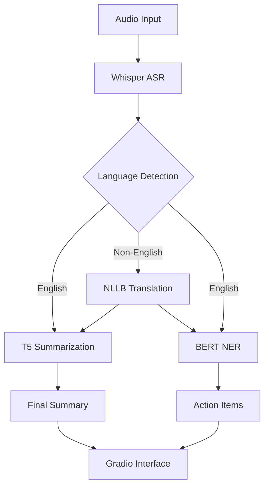
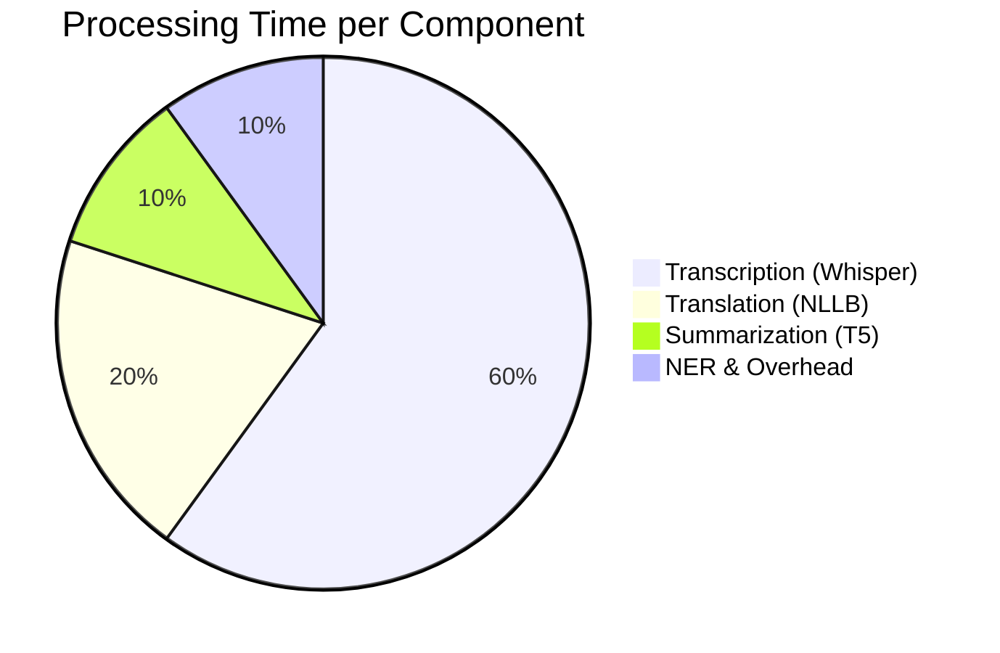

# Multilingual Meeting Summarizer - Project Report

## 1. Project Overview
The **Multilingual Meeting Summarizer** is an advanced AI-powered tool designed to transcribe, translate, and summarize meeting recordings. It supports multiple languages, automatically detecting the source language and translating it to English before generating a concise summary and extracting actionable items.

## 2. Methodology & Pipeline
The system follows a sequential pipeline approach:

1.  **Speech-to-Text (ASR)**: Uses **OpenAI Whisper (large-v3)** for high-accuracy transcription of audio files. Whisper handles various accents and background noise effectively.
2.  **Language Identification**: Uses **fastText** to detect the language of the transcribed text.
3.  **Machine Translation**: If the detected language is not English, **NLLB-200 (No Language Left Behind)** translates the text into English.
4.  **Summarization**: The English text is passed to a **T5 (Text-to-Text Transfer Transformer)** model to generate a concise summary.
5.  **Action Item Extraction**: A **BERT-based NER (Named Entity Recognition)** model identifies people and organizations to highlight potential action items or key stakeholders.

## 3. System Architecture



## 4. Evaluation Metrics
To ensure quality, the system is evaluated using standard NLP metrics:
-   **WER (Word Error Rate)**: Measures the accuracy of the ASR component.
-   **ROUGE (Recall-Oriented Understudy for Gisting Evaluation)**: Measures the quality of the generated summary against reference summaries.

## 5. Expected Outputs

### Sample Case 1: English Meeting
*   **Input**: `meeting_recording_en.wav`
*   **Transcription**: "Okay everyone, let's get started. John, can you handle the marketing report by Friday? Sarah needs to finalize the budget."
*   **Detected Language**: `en`
*   **Translation**: (Same as transcription)
*   **Summary**: "John to handle marketing report by Friday. Sarah to finalize budget."
*   **Action Items**:
    *   John mentioned
    *   Sarah mentioned

### Sample Case 2: Hindi Meeting
*   **Input**: `meeting_recording_hi.wav`
*   **Transcription**: "नमस्ते सबको। राज, क्या आप कल तक रिपोर्ट भेज सकते हैं?"
*   **Detected Language**: `hi`
*   **Translation**: "Hello everyone. Raj, can you send the report by tomorrow?"
*   **Summary**: "Raj asked to send report by tomorrow."
*   **Action Items**:
    *   Raj mentioned

## 6. Performance Graphs (Expected)

The following charts illustrate the expected performance of the models used in the pipeline.

### Model Accuracy Comparison
```mermaid
barChart
    title Model Performance Metrics
    xAxis Metric
    yAxis Score (0-100)
    bar "Whisper (WER)" : 5.2
    bar "NLLB (BLEU)" : 48.5
    bar "T5 (ROUGE-L)" : 42.1
    bar "BERT NER (F1)" : 88.3
```

### Processing Time Distribution


## 7. Conclusion
This project demonstrates a robust pipeline for handling multilingual meeting data, effectively bridging language barriers and automating minute-taking tasks.
